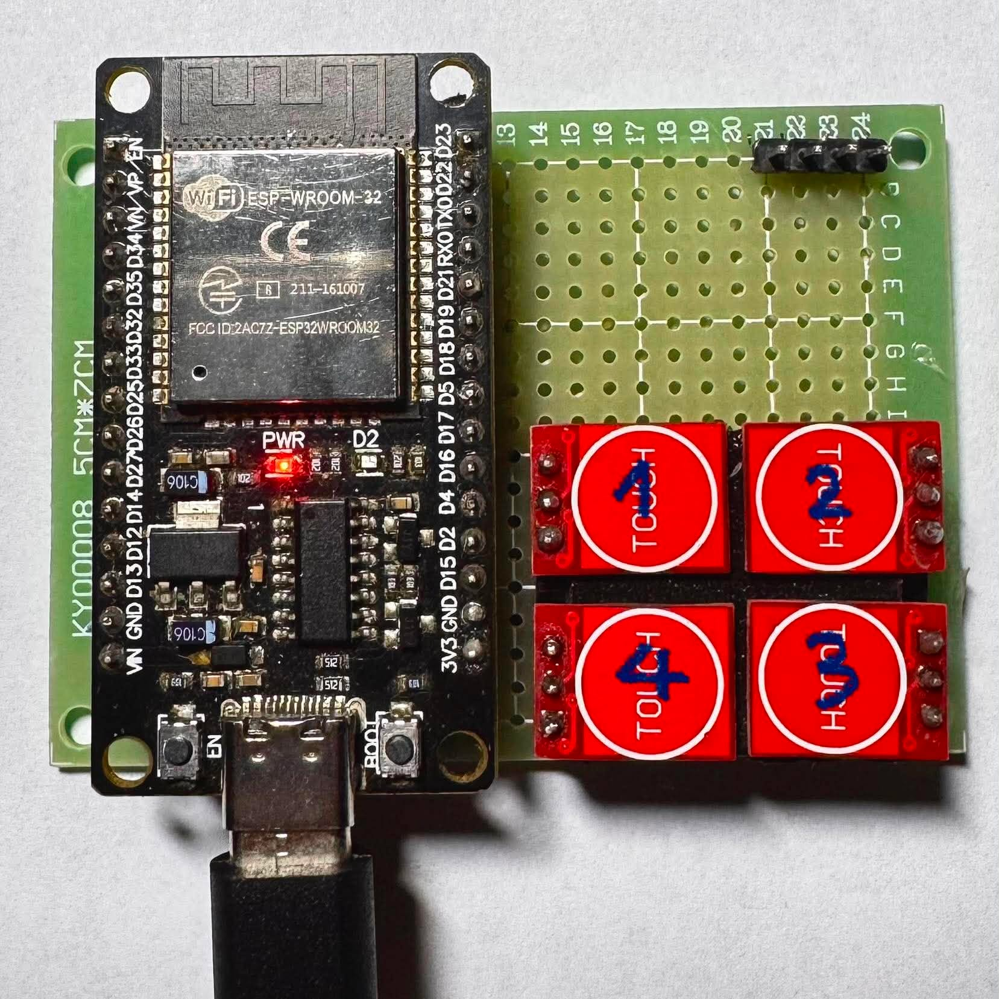
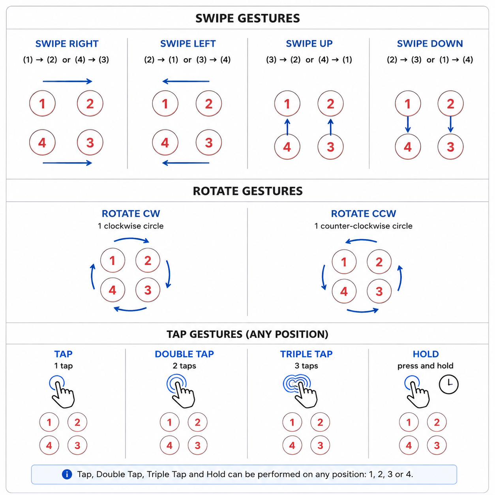

# GesturePad_Demo

Demo application for testing and validating gesture recognition using the GesturePad component.

<table>
<tr>
<td align="center">
    
</td>
<td align="center">
    
</td>
</tr>
</table>

## Supported Gestures

- Swipe Up
- Swipe Down
- Swipe Left
- Swipe Right
- Rotate Clockwise (CW)
- Rotate Counter-Clockwise (CCW)
- Tap
- Double Tap
- Triple Tap
- Hold

## Example Output

```bash
I (278) main_task: Returned from app_main()
I (9378) [GESTUREPAD_EXAMPLE]: Gesture: ROTATE CW
I (10718) [GESTUREPAD_EXAMPLE]: Gesture: ROTATE CCW
I (12698) [GESTUREPAD_EXAMPLE]: Gesture: SWIPE DOWN
I (14088) [GESTUREPAD_EXAMPLE]: Gesture: SWIPE UP
I (15328) [GESTUREPAD_EXAMPLE]: Gesture: SWIPE RIGHT
I (16748) [GESTUREPAD_EXAMPLE]: Gesture: SWIPE LEFT
I (18438) [GESTUREPAD_EXAMPLE]: Gesture: TAP
I (20098) [GESTUREPAD_EXAMPLE]: Gesture: DOUBLE TAP
I (21818) [GESTUREPAD_EXAMPLE]: Gesture: TRIPLE TAP
I (23568) [GESTUREPAD_EXAMPLE]: Gesture: HOLD
```
