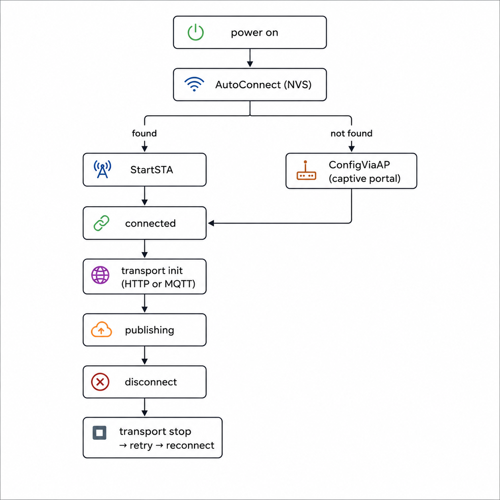

# BH1750_Demo

## Overview

Firmware built with **ESP-IDFIDF**. Collects BH1750 data and publishes to **ThingsBoard Cloud** via HTTPS or MQTTS.

---

## Project Structure

```text
📁 components
├── hardware                        # Config button, status LED
│   ├── hardware_config.h
│   ├── hardware_config.c
│   └── CMakeLists.txt
│
├── network                         # Network layer
│   ├── include
│   │   ├── network.h
│   │   └── network_config.h
│   ├── transport
│   │   ├── http                    # HTTPS transport API
│   │   │   ├── http_transport.h
│   │   │   └── http_transport.c
│   │   └── mqtt                    # MQTTS transport API
│   │       ├── mqtt_transport.h
│   │       └── mqtt_transport.c
│   ├── wifi
│   │   ├── WiFiManager            # hphuc15/WiFiManager
│   │   ├── wifi.c
│   │   └── wifi.h
│   ├── CMakeLists.txt
│   └── network.c
│
└── sensors                         # Sensor acquisition
    ├── bare-drivers                # hphuc15/bare-drivers
    │   └── bh1750
    │       ├── include
    │       │   └── bh1750.h
    │       └── bh1750.c
    ├── i2c                         # I2C bus and device configuration
    │   ├── i2c.h
    │   └── i2c.c
    ├── sensors.h                   # sensors layer
    ├── sensors.c
    └── CMakeLists.txt

📁 main
├── app                             # Application layer
│   ├── app.h
│   └── app.c
├── main.c
└── CMakeLists.txt
```

---

## Flow

<p align="center">
  
</p>

---

## Sample Config

| Macro | Value |
|---|---|
| `NETWORK_HOST` | `thingsboard.cloud` |
| `NETWORK_PORT` | `443` |
| `NETWORK_DEVICE_TOKEN` | `<device_token>` |
| `NETWORK_MQTT_TOPIC` | `v1/devices/me/telemetry` |
| `HTTP_PAYLOAD_SIZE` | `256` |